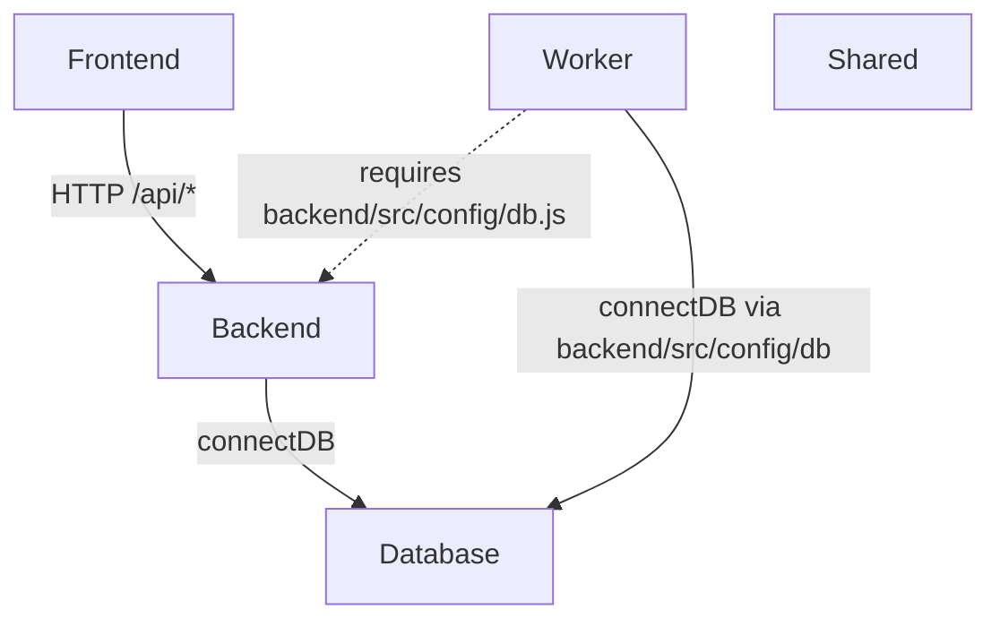

# Job_Search_By_Linkdin — Architecture

## 1. Stack
- MERN-style JS monorepo, single subproject `resume_job_portal/` (README.md: "Resume-based job search portal built with MERN").
- Backend: Node.js + Express (`resume_job_portal/backend/src/app.js` — `require("express")`, `require("cors")`), MongoDB via `backend/src/config/db.js` (referenced, not read).
- Frontend: React (`resume_job_portal/frontend/src/main.jsx` — `react`, `react-dom/client`), Vite build (presence of `frontend/vite.config.js`, `frontend/index.html`).
- Worker: plain Node.js background process (`resume_job_portal/worker/src/index.js`) — cron-style scheduler, reuses backend's DB config directly.
- Root orchestration: `resume_job_portal/package.json` — thin wrapper with `dotenv` dep and per-app npm scripts.

## 2. Directory map
| path | what lives there |
|---|---|
| `resume_job_portal/` | root of the actual app (repo root itself has only README + a shell script) |
| `resume_job_portal/backend/` | Express API (`src/app.js`, `src/server.js`, `src/routes`, `src/controllers`, `src/services`, `src/models`, `src/config`) |
| `resume_job_portal/frontend/` | React + Vite SPA (`src/main.jsx`, `src/App.jsx`, `src/pages`, `src/api`, `src/styles`) |
| `resume_job_portal/worker/` | Background job runner (`src/index.js`, `src/queue.js`, `src/jobs`, `src/schedulers`) |
| `resume_job_portal/shared/` | Cross-app JS (`constants/index.js`, `utils/helpers.js`) |
| `resume_job_portal/docs/` | `api-contract.md`, `architecture.md`, `mvp-roadmap.md` (not read — out of task scope) |

## 3. Diagram

## 4. Component index
- [[Frontend]]
- [[Backend]]
- [[Worker]]
- [[Database]]
- [[Shared]]

## 5. Entry points
- Frontend dev: `resume_job_portal/frontend/src/main.jsx` (mounted via `frontend/index.html`, run through Vite — `frontend/vite.config.js` present).
- Backend dev/prod: `resume_job_portal/backend/src/server.js` (loads `.env`, calls `connectDB()`, then `app.listen`); Express app itself defined in `resume_job_portal/backend/src/app.js`.
- Worker dev/prod: `resume_job_portal/worker/src/index.js` (loads `backend/.env`, calls shared `connectDB`, then `startScheduler()`).
- Root convenience scripts (`resume_job_portal/package.json`): `npm run backend`, `npm run frontend`, `npm run worker` — each does `npm run dev --prefix <app>`.

## 6. Conventions (observed only)
- Backend routes are mounted by resource under `/api/<resource>`: `/api/resume`, `/api/jobs`, `/api/matches` (`backend/src/app.js`).
- Backend route files named `<resource>.routes.js`, imported directly into `app.js` (e.g. `./routes/resume.routes`).
- Backend uploads served statically from `/uploads` mapped to an `uploads/` dir (`backend/src/app.js` line 11).
- Backend startup errors from DB connection cause `process.exit(1)` (`backend/src/server.js`).
- Worker startup follows the same pattern: connect, then start, `.catch` → log + `process.exit(1)` (`worker/src/index.js`).
- Worker does not have its own DB config — it reaches across into `../../backend/src/config/db` and `../../backend/.env` rather than duplicating them (`worker/src/index.js` lines 1–3).
- Frontend pages live under `frontend/src/pages/` (e.g. `UploadResume`, `MatchedJobs`, imported in `App.jsx`); API calls go through a single `frontend/src/api/http` module.
- Frontend root component (`App.jsx`) owns all top-level state (jobs, matches, filters, sort, status) and passes callbacks/props down — no separate state-management library observed.

## 7. Where things go
- New backend REST resource: add `backend/src/routes/<name>.routes.js`, a controller in `backend/src/controllers/`, wire it into `backend/src/app.js` with `app.use("/api/<name>", ...)`.
- New frontend page/view: add a component under `frontend/src/pages/`, wire it into `frontend/src/App.jsx`.
- New scheduled/background job: add a module under `worker/src/jobs/`, register it in `worker/src/schedulers/cron.js` (referenced via `startScheduler`, not read).
- New cross-cutting constant/helper shared by backend and worker: add to `resume_job_portal/shared/constants/` or `shared/utils/` (usage by backend/worker not directly confirmed — TODO: verify).
- New env var: add to `resume_job_portal/backend/.env` (backend + worker both read from this file today per `worker/src/index.js`).
